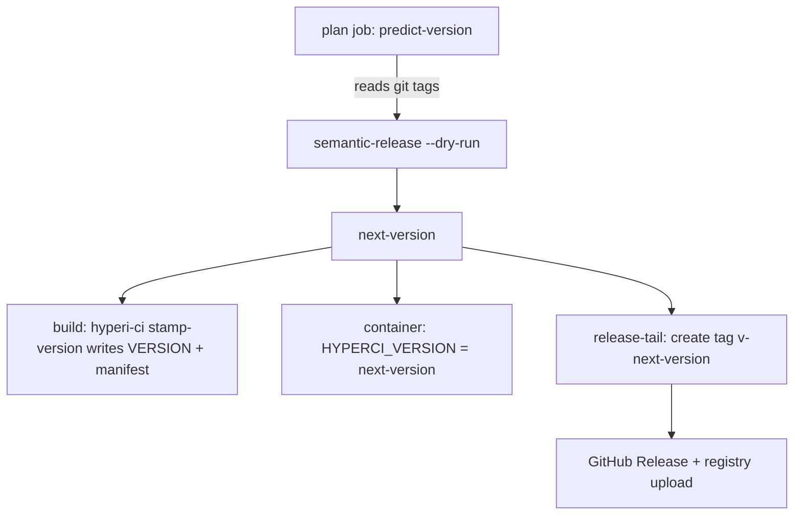

<!--
Project:   HyperI CI
File:      docs/versioning.md
Purpose:   Where a version comes from, and which files are outputs

License:   BUSL-1.1 -- HYPERI PTY LIMITED
Copyright: (c) 2026 HYPERI PTY LIMITED
-->

# Versioning

## The git tag is the only truth

A `v*` git tag says a version was released. Nothing else does. Tag-on-publish
means a tag exists iff the artefact is in the registry, so the tag list is the
release history -- the same convention kubernetes, rust and python use.

Everything else that carries a version number is an **output**:

| File | Written by | Read as truth? |
|------|-----------|----------------|
| `VERSION` | `hyperi-ci stamp-version`, at build time | No |
| `CHANGELOG.md` | `@semantic-release/changelog`, at release time | No |
| `Cargo.toml` / `pyproject.toml` / `package.json` version | `stamp-version`, at build time | Only to seed a tag-less repo |
| Files in `release.stamp_paths` | `release.stamp_cmd`, run by `stamp-version` | No |
| The `[tool.hatch.version] path` file of a `dynamic = ["version"]` project | `stamp-version`, at build time | No |
| The git tag | `tag-head` / semantic-release, at release time | **Yes** |

A hatch dynamic version read from a file (`path = "src/<pkg>/__init__.py"`) gets the version written where hatch's `pattern` finds it, or hatchling's default `__version__ = "..."` pattern. If the file is missing or the pattern finds nothing, `stamp-version` fails rather than let the build ship a wheel with the old version. The same goes for a hatch version source it does not know. `source = "vcs"` is left to hatch-vcs, which reads git, and `source = "code"` is left to the build, which evaluates it (hyperi-ci's own reads `VERSION`).

Reading an output as an input is what issue #85 was about: `VERSION` froze at
`2.3.10` in May 2026 across 14 repos, and every code path that fell back to it
computed from a value dozens of releases stale.

## What resolves a version, and when


```mermaid
flowchart TD
    P[plan job: predict-version] -->|"reads git tags"| SR[semantic-release --dry-run]
    SR --> NV[next-version]
    NV --> B["build: hyperi-ci stamp-version writes VERSION + manifest"]
    NV --> C["container: HYPERCI_VERSION = next-version"]
    NV --> T["release-tail: create tag v-next-version"]
    T --> R[GitHub Release + registry upload]
```

`HYPERCI_VERSION` carries the plan job's answer to every downstream job, so all
of them agree. `common.resolve_release_version` is the single reader:
`HYPERCI_VERSION` -> `VERSION` (written moments earlier by the stamp step) ->
latest `v*` tag. Do not re-implement it per stage.

A retroactive `tag` dispatch (`hyperi-ci release vX.Y.Z`) skips semantic-release: `next-version` is the tag's own version, minus the `v`. The tagged tree cannot answer, because `VERSION` and the manifest are committed back after the tag, so Build and Container stamp it like any other release.

Re-publishing a version below the highest stable `v*` tag publishes its versioned artefacts and moves no `latest` pointer. R2 `<project>/latest/`, the GHCR `:latest` tag and the GitHub Release Latest flag stay on the newest release, and the log names each one it held back. `common.holds_latest` makes that call from the local tags, which is why the Container job checks out with `fetch-tags: true`.

## A repo with no tags

Exactly one question a tag cannot answer: what should the FIRST tag be?

The answer comes from what the project already declares about itself --
`pyproject.toml` `[project] version`, `Cargo.toml` `[package] version` (or
`[workspace.package]`), `package.json` `version`. A project with nothing to
declare (Go has no manifest version; a `dynamic = ["version"]` Python project
has no static one) starts at **`0.1.0`**: no declaration means no stability
promise, and semver reserves `0.x` for that.

```bash
hyperi-ci seed-version            # 0.1.0
hyperi-ci seed-version --source   # 0.1.0	default
hyperi-ci seed-tag --dry-run      # what it would create, and from where
hyperi-ci seed-tag                # create it
```

`hyperi-ci init` seeds the tag automatically (`--no-seed-tag` to skip). It is
idempotent: a repo with any `v*` tag already has its truth, and seeding declines
rather than adding a second opinion.

The seed tag is a **starting marker, not a release** -- its message says so.
The first release bumps from it, so tag-on-publish stays honest: no seed tag
ever claims an artefact.

The same value feeds the first release. On a tag-less repo `predict-version`
ships it verbatim (semantic-release would otherwise default to `1.0.0`), while
the forced `--bump patch|minor` paths bump *from* it -- a bump is a bump, even
against a declared start.

## VERSION and CHANGELOG.md

`VERSION` is a generated artefact, stamped by `hyperi-ci stamp-version` before
the build and committed back by CI only after a successful release. Never
edit it by hand -- the next release overwrites whatever you write. The
commit-back mechanics (why not `@semantic-release/git`, how `release-commit`
avoids orphaning a tag, and how other stamped files like a generated OpenAPI
spec stay in step) are in [versioning-commit-back.md](versioning-commit-back.md).

`CHANGELOG.md` is rendered by `@semantic-release/changelog` during the release, and committed back
by the same `release-commit` step. Release notes also appear on the **GitHub
Releases page**, one per tag.

Entries below 2.4.0 predate the plugin removal; the gap between 2.3.10 and the
version that restored this is not recoverable from the file, only from the
Releases page.

### Supplementary notes

A repo adds hand-written notes to a release by committing
`.github/release-notes/NEXT.md` before the release. `@semantic-release/exec`
prints the file during `generateNotes`, and semantic-release joins every
plugin's notes, so the text lands under the version heading alongside the
generated commit list. The GitHub Release body carries the same rendered entry:
`publish` reads the top entry out of `CHANGELOG.md` and passes it to
`gh release create --notes-file`, above GitHub's own generated notes.

`release-commit` deletes `NEXT.md` in the same commit that lands the changelog,
so one supplement reaches one release. Write the next one when there is
something to say. An absent file changes nothing.

## After the release lands

Two steps close the loop, both idempotent and both `continue-on-error` -- a
notification must never turn an already-shipped release red:

| Step | What it does |
|------|--------------|
| `release-notify --outcome success` | Comments on every issue and PR referenced by the commits in the release |
| `release-notify --outcome failure` | Opens (or reuses) a `release-failure` issue naming the run and the retry command |
| `release-notify --outcome commit-back-failed` | When `release-commit` fails: one `release-commit-back` issue per repo naming the fix, a comment per later version. Closed by hand |

These replace what `@semantic-release/github`'s `success` / `fail` steps would
do; that plugin is never loaded, being the other half of the #37 pair.

Slack is off unless `notify.slack.webhook_env` names an environment variable
holding a webhook URL. The URL never goes in config -- config is committed.

## Before the release starts

`hyperi-ci preflight` runs in the plan job on a release run: semantic-release's
`verifyConditions` equivalent. It checks only the destinations the project
actually publishes to, and blocks only where the handler hard-fails without the
credential.

| Destination | Missing credential |
|-------------|--------------------|
| crates.io | **blocks** -- `cargo publish` cannot authenticate |
| npm | **blocks** -- `npm publish` cannot authenticate |
| PyPI | warns -- the upload falls back to OIDC trusted publishing |
| Cloudflare R2 | warns -- binaries reach GitHub Releases but not downloads.hyperi.io |

A Rust binary app is never asked for a crates.io token: its publish handler
returns early whatever `release.destinations.cargo` says (the old
`publish.destinations_oss.cargo` still resolves). Outside CI the whole check
is a no-op.

## Forcing a release

Commits that aren't release-worthy under conventional-commits rules still
sometimes need to ship (a docs-only PR, a forced rebuild):

```bash
hyperi-ci push --bump-patch    # +0.0.1 from the latest tag
hyperi-ci push --bump-minor    # +0.1.0 from the latest tag
hyperi-ci release --version 2.9.10   # explicit, to step past a taken tag
```

Major bumps are excluded on purpose -- they need a human-written breaking-change
footer.

## See also

- [versioning-commit-back.md](versioning-commit-back.md) -- how VERSION gets
  committed back after a release, and the stamp_cmd mechanics
- [prereleases.md](prereleases.md) -- cutting `1.2.0-beta.1` off a branch so a
  release can be rehearsed without the stable sequence moving
- [versioning-and-the-suite.md](versioning-and-the-suite.md) -- how this
  per-repo line relates to a DFE stack version, and which ladder owns `rc`
- [architecture.md](architecture.md) -- the job graph these versions flow through
- [flow.md](flow.md) -- the release sequence, trigger to registry
- [migration/onboarding.md](migration/onboarding.md) -- adopting hyperi-ci
